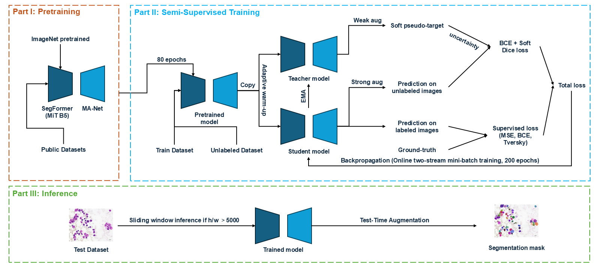

# MUST

**MUST: Mean-teacher inspired and Uncertainty-aware Semi-supervised Transformer for cell instance segmentation**

MUST is a PyTorch implementation for annotation-efficient cell instance segmentation in multi-modality microscopy images. It combines a SegFormer MiT-B5 encoder, an MA-Net decoder, supervised cell-probability and gradient-flow learning, and an online EMA teacher-student scheme. Under our controlled 10%-labeled CellSeg protocol, MUST achieves an **Overall F1 score of 0.8878** with only 10% of the original labeled training images on the official public tuning set, which is used as the final test set in this repository.

<p align="center">
  
</p>

## Overview and method

MUST is designed for low-label cell instance segmentation, where dense annotations are expensive and microscopy modalities differ substantially in appearance. The final model is trained in a **single-modality** manner: one model is trained for each modality and predictions are aggregated for the final Overall score.

The framework has five main components:

- **SegFormer-MA-Net backbone:** a SegFormer MiT-B5 encoder and an MA-Net decoder produce a foreground cell-probability map and a two-channel gradient-flow field.
- **Supervised objective:** labeled images are optimized with BCE, Tversky, and gradient-flow regression losses.
- **Adaptive supervised warm-up:** unlabeled consistency learning is activated only after the validation instance-level F1 reaches a reliability threshold or the maximum warm-up length is reached.
- **Soft EMA teacher consistency:** an EMA teacher generates soft foreground probability maps from weakly perturbed unlabeled images; the student learns from strongly perturbed views using BCE + soft Dice consistency.
- **Uncertainty-aware reliability control:** entropy- and region-aware weighting, together with dynamic unsupervised loss scaling, regulates where and how strongly the student should trust teacher predictions.

During inference, MUST uses sliding-window prediction and horizontal/vertical test-time augmentation. Instance masks are reconstructed from the fused foreground probability and gradient-flow outputs.

## CellSeg dataset and protocol

MUST is evaluated on the **CellSeg** dataset from the NeurIPS 2022 Cell Segmentation Challenge:

https://neurips22-cellseg.grand-challenge.org/

The dataset contains Brightfield, Fluorescent, phase contrast (PC), and differential interference contrast (DIC) microscopy images. Since the official hidden test annotations are not publicly available, the public tuning set is used as the isolated test set in this repository.

### Original CellSeg distribution

| Modality | Labeled train | Tuning / test | Official unlabeled |
|---|---:|---:|---:|
| Brightfield | 297 | 30 | 645 |
| Fluorescent | 300 | 28 | 155 |
| PC | 203 | 23 | 337 |
| DIC | 200 | 20 | 588 |
| **Total** | **1000** | **101** | **1725** |

### 10%-labeled controlled protocol

The main controlled protocol uses only the original 1,000 labeled training images. They are split into three mutually disjoint subsets: 10% labeled training data, 10% validation data, and 80% unlabeled training data with annotations ignored. The public tuning set is used only for final evaluation. The official 1,725 unlabeled images are included in the mapping files but are **not** used in the main controlled experiments.

| Modality | Labeled train | Validation | Unlabeled train | Test |
|---|---:|---:|---:|---:|
| Brightfield | 30 | 30 | 237 | 30 |
| Fluorescent | 30 | 30 | 240 | 28 |
| PC | 20 | 20 | 163 | 23 |
| DIC | 20 | 20 | 160 | 20 |
| **Total** | **100** | **100** | **800** | **101** |

The validation split is used for model selection, adaptive warm-up activation, and early stopping. The experiment configurations control the main stochastic sources, and the manuscript reports matched repeated runs with paired statistical tests.

### External pretraining data

Before CellSeg adaptation, MUST is pretrained on an external annotated cell-segmentation pool built from OmniPose, CellPose, LiveCell, and DSB2018. This external pool is disjoint from CellSeg and contains 7,500 annotated images.

| Public set | Source train | Source test/val | Modalities |
|---|-------------:|----------------:|---|
| OmniPose |          500 |             294 | Fluorescent, PC |
| CellPose |          796 |              68 | Fluorescent |
| LiveCell |         3727 |            1512 | PC |
| DSB2018 |          603 |               0 | PC |
| **Total** |     **5626** |        **1874** | — |

## Repository layout

```text
MUST/
├── assets/
│   └── must_framework.png
├── config/
│   ├── MUST.json
│   ├── pretraining.json
│   ├── prediction.json
│   ├── baselines/
│   ├── ablations/
│   └── mappings/
├── core/
│   ├── BaseTrainer.py
│   ├── BasePredictor.py
│   └── MUST/
├── train_tools/
│   ├── data_utils/
│   ├── models/
│   ├── measures.py
│   └── utils.py
├── data/
│   └── CellSeg/
│       ├── Official/
│       │   ├── Train_Labeled/
│       │   ├── TuningSet/
│       │   └── Unlabeled/
│       └── Public/
├── weights/
│   ├── pretrained/
│   │   └── pretrained.pth
│   └── final/
│       ├── Brightfield/
│       │   └── model.pth
│       ├── Fluorescent/
│       │   └── model.pth
│       ├── PC/
│       │   └── model.pth
│       └── DIC/
│           └── model.pth
├── main.py
├── main_single_modality.py
├── main_multi_modality.py
├── predict.py
├── infer.py
├── evaluate.py
├── generate_mapping.py
├── subdataset_generator.py
├── requirements.txt
└── SetupDict.py
```

`data/`, large checkpoints, and generated `results/` are not included in the repository because of size.

## Installation

The reference experiments were conducted on an NVIDIA H100 GPU environment. The main software stack used in the manuscript is summarized below.

| Component | Version / setting |
|---|---|
| GPU | NVIDIA H100, 80 GB memory |
| CUDA | 12.4.1 |
| cuDNN | 9.2.0.82 |
| NCCL | 2.21.5 |
| Python | 3.11.9 |
| Framework | PyTorch 2.4.0 + torchvision 0.19.0 |

A typical installation is:

```bash
conda create -n must python=3.11 -y
conda activate must

pip install torch==2.4.0 torchvision==0.19.0 --index-url https://download.pytorch.org/whl/cu124
pip install -r requirements.txt
```

If your CUDA environment differs from CUDA 12.4, install the matching PyTorch and torchvision wheels first, then install the remaining packages from `requirements.txt`.

## Data preparation

Place the CellSeg data and external public pretraining data under `./data/CellSeg/`:

```text
data/CellSeg/
├── Official/
│   ├── Train_Labeled/
│   │   ├── images/
│   │   └── labels/
│   ├── TuningSet/
│   │   ├── images/
│   │   └── labels/
│   └── Unlabeled/
│       └── images/
└── Public/
    ├── images/
    └── labels/
```

The expected label filename format is:

```text
<image_stem>_label.tiff
```

Example:

```text
Official/Train_Labeled/images/cell_00001.bmp
Official/Train_Labeled/labels/cell_00001_label.tiff
```

The repository provides the mapping files used by the paper protocol:

```text
config/mappings/
├── cellseg_mapping_setup.json
├── mapping_train.json
├── mapping_train_10pct.json
├── mapping_val_10pct.json
├── mapping_unlabeled_10pct.json
├── mapping_test.json
├── mapping_public.json
└── mapping_unlabeled_official.json
```

To regenerate full dataset mappings from data folders and modality CSV files:

```bash
python generate_mapping.py --root ./data/CellSeg --map_dir ./config/mappings
```

To regenerate a 10%-labeled split from the full training mapping:

```bash
python subdataset_generator.py \
  --input_mapping ./config/mappings/mapping_train.json \
  --output_dir ./config/mappings/subsets/train_10pct
```

## Checkpoints

Large checkpoint files are not included in this repository.

The training configurations expect the external-pretrained initialization checkpoint at:

```text
weights/pretrained/pretrained.pth
```

If you want to run standalone inference without retraining, download the four modality-specific final checkpoints and place them as follows:

```text
weights/final/
├── Brightfield/model.pth
├── Fluorescent/model.pth
├── PC/model.pth
└── DIC/model.pth
```

| Checkpoint | Expected path | Google Drive | Baidu Netdisk |
|---|---|---|---|
| External-pretrained MUST initialization | `weights/pretrained/pretrained.pth` | `https://drive.google.com/file/d/1RnNHi86sKSLSuYsOTVjw2PEYAmQUrdEh/view?usp=drive_link` | `https://pan.baidu.com/s/1sYthvvevQApRY-olwQERnA?pwd=9p49` |
| Brightfield final checkpoint | `weights/final/Brightfield/model.pth` | `https://drive.google.com/file/d/1lrZgz6StxWOQnbQyPxaXw9HqQrXqI6Ub/view?usp=drive_link` | `https://pan.baidu.com/s/1UdMNTsQbWsL_NdaFZhmMsw?pwd=uq19` |
| Fluorescent final checkpoint | `weights/final/Fluorescent/model.pth` | `https://drive.google.com/file/d/1PkTq9FdQVKHv_732lQPUxbNgGdbWqmqk/view?usp=drive_link` | `https://pan.baidu.com/s/1Sfi1O4yB0t0RQ1sDTGK1vA?pwd=x4g5` |
| PC final checkpoint | `weights/final/PC/model.pth` | `https://drive.google.com/file/d/1e_NMFhhsLo9_xeSh5d9FcMT0wHfvOpwp/view?usp=drive_link` | `https://pan.baidu.com/s/1dh5ho1bvtqfDcUNKeHDtkw?pwd=xaxh` |
| DIC final checkpoint | `weights/final/DIC/model.pth` | `https://drive.google.com/file/d/12o-WbpmB2afs5MrZvMb8V6NuFzTylkLI/view?usp=drive_link` | `https://pan.baidu.com/s/1QR1ESnUT8AxQhn6zA_xypQ?pwd=t926` |

### Prediction and evaluation

For standalone inference, run each modality with its corresponding checkpoint:

```bash
python infer.py \
  --model_path ./weights/final/Brightfield/model.pth \
  --modality Brightfield \
  --output_root ./results/infer/Brightfield

python infer.py \
  --model_path ./weights/final/Fluorescent/model.pth \
  --modality Fluorescent \
  --output_root ./results/infer/Fluorescent

python infer.py \
  --model_path ./weights/final/PC/model.pth \
  --modality PC \
  --output_root ./results/infer/PC

python infer.py \
  --model_path ./weights/final/DIC/model.pth \
  --modality DIC \
  --output_root ./results/infer/DIC
```

You can also run prediction and evaluation separately:

```bash
python predict.py --config_path ./config/prediction.json

python evaluate.py \
  --gt_path ./data/CellSeg/Official/TuningSet/labels \
  --pred_path ./results/must/single_modality/overall \
  --save_path ./results/must/evaluation \
  --mapping_file ./config/mappings/mapping_test.json \
  --root ./data/CellSeg \
  --modality multi
```

The evaluation reports instance-level precision, recall, and F1 using an IoU threshold of 0.5.

## Citation

The paper is currently under review. Citation information will be added after publication.
